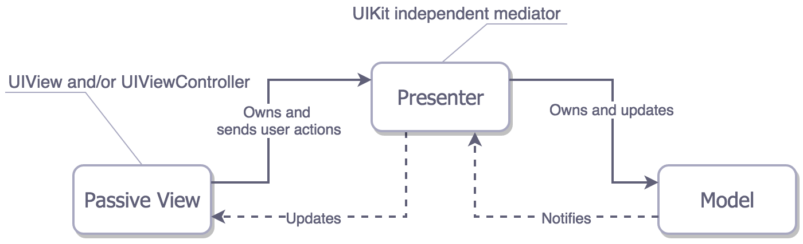

# MostPopularMovies

## Build and run

To build and run this app, you'll need an Xcode version that supports Swift 4.1 and iOS 11 or higher. The ``develop`` branch contains the latest code and is ready to be built and run as is. No change to the code or settings should be necessary in order to build and run the app. All third-party libraries have been added to the Git repository, so they are already available.

## Dependency Management

This project uses CocoaPods to manage its dependencies. The Pods folder has been pushed to the repository so that it is simple to clone the project, build, and run it right out of the box.

## Third-party Libraries

### Alamofire

This project uses Alamofire, the de facto networking library on iOS powering thousands of apps. Alamofire helped simplify the service classes, as it provides a simple API to create and validate network requests according to industry standards.

### OHHTTPStubs

The unit tests of this project rely heavily on OHHTTPStubs to easily stub server requests. OHHTTPStubs provides a simple API to customize stubs for each network request.

## Architecture

This project uses the Model-View-Presenter (MVP) architecture. In this architecture, UIViews and UIViewControllers are all part of the **view** and don't have much logic in them, as they passively wait for the presenter to tell them what to display on screen and how. Therefore, the **presenter** is responsible for handling much of the business logic and for preparing the content to be presented by the view. The main purpose of the Model-View-Presenter architecture as developed in this app is to simplify and enhance unit testing by completely isolating the parts of the UIKit framework that are hard or impossible to test. The presenter and the model should both be totally independent of the life cycle of UIViewControllers, which allows them to be fully tested. The following diagram shows how this architecture was implemented in this app.

## Caching

Since the TMDB API thouroughly supports caching, the default caching mechanisms of the iOS system were used to implement caching in this project. All resources downloaded by the app, such as JSONs and images, are locally cached by the system and can be reused by the app in case it isn't able to connect with the server. The following diagram shows the cache policy in place in this app, as implemented by the system.

